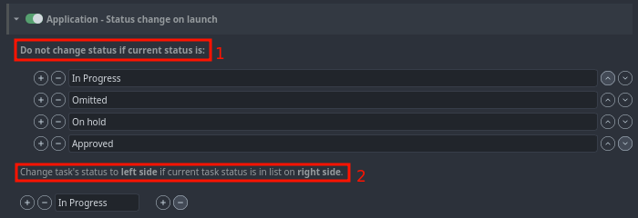

# Server Actions/Events
## Sync to avalon
More informations [here](module_ftrack/#sync-to-avalon.md).

## Prepare Project
More informations [here](manager_ftrack_actions/#prepare-project.md)

## Sync Hierarchical and Entity Attributes
More informations [here](module_ftrack/#synchronize-hierarchical-and-entity-attributes.md).

## Clone Review Session
On enabled: clone option is only available to a specific users.

## Update Hierarchy thumbnails
More informations [here](module_ftrack/#update-hierarchy-thumbnails.md).

## Run script on user assignments
On enabled : runs a script each time a task is assigned to a specific user.

## Update status on task action
More informations [here](module_ftrack/#update-status-on-task-action.md).

## Sync status from Task to Parent
More informations [here](module_ftrack/#sync-status-from-task-to-parent.md).

## Sync status from Task to Version
Changes status of task's latest asset versions on its status change.
Set on the left the Version name, and on the right the Task names.

## Sync status from Version to Task
More informations [here](module_ftrack/#sync-status-from-version-to-task.md).

## Update status from Version to Task
Updates Task status based on status changes on it's `AssetVersion`.

The issue this solves is when Asset version's status is changed but the artist assigned to Task is looking at the task status, thus not noticing the review.

This event makes sure statuses Asset Version get synced to it's task. After changing a status on version, this event first tries to set identical status to version's parent (usually task). At this moment there are a few more status mappings hardcoded into the system. If Asset version's status was changed to:

-   `Reviewed` then Task's status will be changed to `Change requested`
-   `Approved` then Task's status will be changed to `Complete`
## Update status on next task
More informations [here](module_ftrack/#update-status-on-next-task.md).

## Action to transfer hierarchical attribute values
Set the users who can transfer hierarchical attributes values.

## Create daily review session
On enabled: create review sessions based on settings (attribute it to a role, automate the daily review's creation everyday, set an hour and a template).
If a review session already exists with the same name, then the process is skiped. If a review session for the current day does not exist, but yesterday's review exists and is empty then yesterday's is renamed, otherwise it creates a new review session.

# User Actions/Events
## Application - Status change on launch
On enabled : Change the task status on launch.

Settings :
1. You can exclude the status change if the task has a specific one.
2. Change task's status to left side if current task status is in list on right side.

## Create/Update Avalon Attributes
Set the users who can create or update Avalon attributes.

## Prepare Project
More informations [here](manager_ftrack_actions/#prepare-project.md)
Enable "Checked" to trigger the "Project Folder Structure"

## Clean hierarchical custom attributes
Set the users who can clean hierarchical custom attributes

## Delete Asset/Subsets
Set the users who can delete the assets and subsets

## Delete old versions
Set the users who can delete the old versions.

## Delivery
Set the users who can deliver.

## Store Thumbnails to avalon
Set the users who can store thumbnails to Avalon.

## Job Killer
Set the users who can job kill.

## Sync to avalon (local) - For development
Set the users who can synchronize to Avalon in local for development.

## Fill workfile Custom attribute
Fill workfile name into a custom attribute on tasks.
Prerequirements are that the project is synchronized so it is possible to access project anatomy and project/asset documents. Tasks that are not synchronized are skipped too.

## Seed Debug Project
Set the users who can seed debug projects.

# Publish plugins
## Collect Ftrack Family
### Profiles
More informations [here](module_ftrack/#collect-ftrack-family).

## Collect Custom Attribute Data
Collect custom attributes from Ftrack for Ftrack entities that can be used in some templates during publishing. You can add **Custom attribute keys**.

## Integrate Hierarchy to ftrack
Set task status on new task creation. Ftrack's default status is used otherwise.

## IntegrateFtrackNote
Set a note template and note labels.

## Integrate Ftrack Description
Add description to AssetVersions.
You can set it as option and/or active.

You can set what can be the template's description. For example, if you set it on {comment} it will take the publishing comment as the template's description.

## ValidateFtrackAttributes
Enable it to validate the Ftrack attributes. You can add custom attributes to validate.

## Integrate Ftrack Instance
### Family Mapping
Set the correspondance between the task name on Ftrack (at the right), and the family on Openpype (at the left).

#### Make subset name as first asset name
On enabled, it will apply to the Ftrack task the asset name (in the case when there are several subsets).

### AssetVersion status on publish
Status to be set in Ftrack on publishing.
You can organize the status names according to the hosts, task types and families. You can also add metadata keys on components.

#### Upload reviewable with origin name
**???**

## Integrate Ftrack Farm Status
### Farm status profiles
Change the status of a task when it's subset is submitted to farm.
You can organize the status names according to the hosts, task types, task names, families and subset names.
